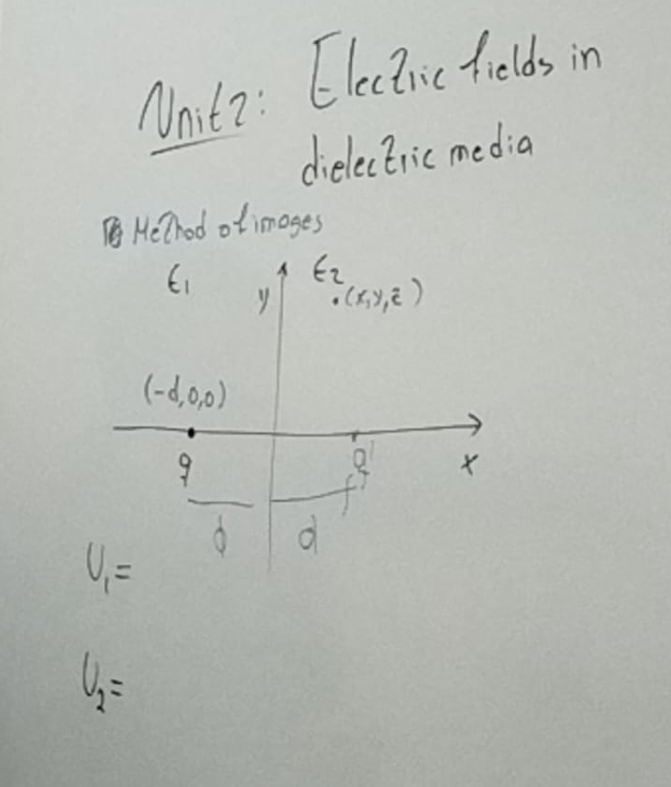
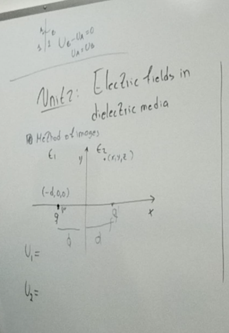
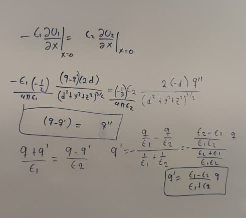
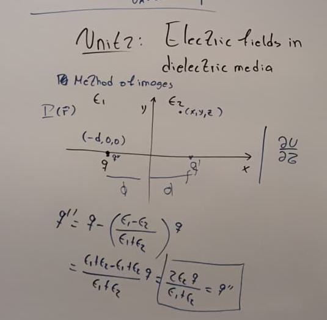
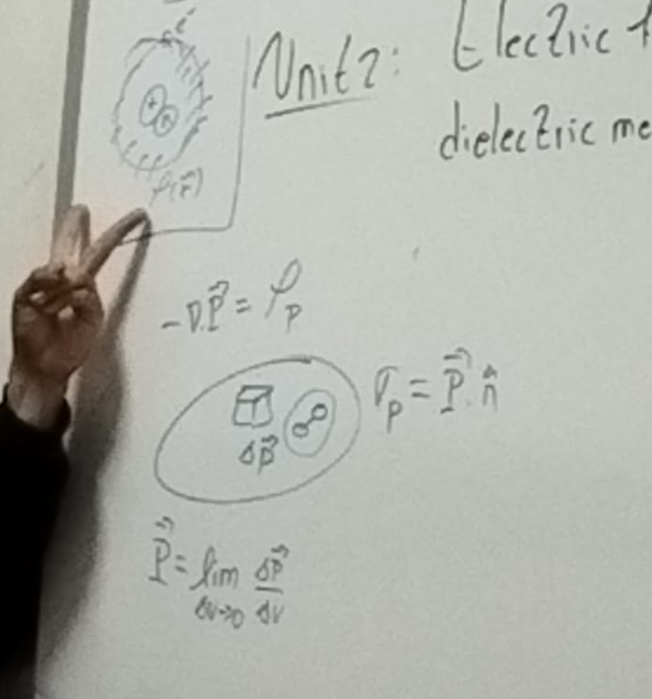
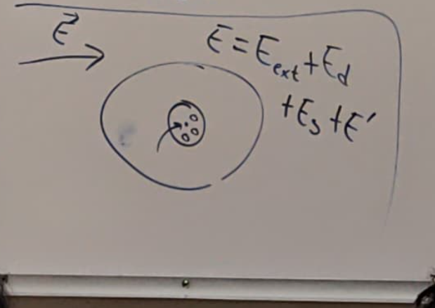

# Clase 29 — Electrodinámica

Apuntes de la **Clase 29** del curso de **Electrodinámica**, desarrollados en **LaTeX** durante la sesión.

En esta clase se abordan conceptos teóricos acompañados de desarrollo matemático y esquemas gráficos, los cuales se reflejan en el documento final en PDF.

---

## Documento principal

- 📄 **[PDF de la clase](C_29_Electrodinámica.pdf)**  
  Versión compilada final del apunte de la clase.

---

## Archivos fuente (LaTeX)

Los siguientes archivos permiten **recompilar el documento** y modificar el contenido:

- 📐 **[Archivo principal LaTeX](C_29_Electrodinámica.tex)**
- 🎨 **[Definición de colores](colores.tex)**
- 📚 **[Bibliografía (.bib)](biblio.bib)**

Estos archivos contienen el contenido original, estilos y referencias utilizadas en el documento.

---

## Figuras y esquemas

A continuación se muestran las figuras incluidas en la clase (las mismas usadas en el documento LaTeX):

*(Las imágenes se cargan directamente desde los archivos utilizados en la compilación LaTeX.)*

---

## Archivos auxiliares

Durante la compilación del documento en un **IDE de LaTeX** (TeXstudio, Overleaf, VS Code + LaTeX Workshop), se generan archivos auxiliares (`.aux`, `.log`, `.out`, `.synctex.gz`, etc.).

Estos archivos:
- ❌ **no contienen contenido académico**
- ❌ **no requieren edición manual**
- ✔️ **solo forman parte del proceso de compilación**

Se conservan únicamente por motivos de reproducibilidad.

---

⬅️ [Volver a Clases en LaTeX — Electrodinámica]({{ '/clases_2025/electrodinamica/latex_clases/' | relative_url }})
