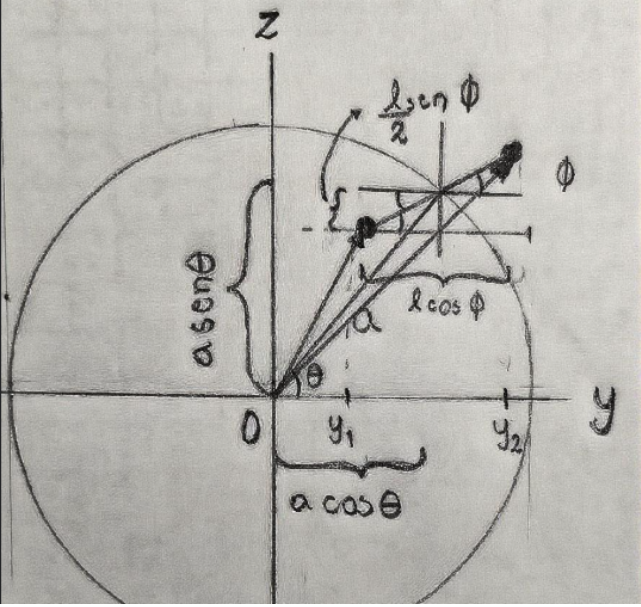
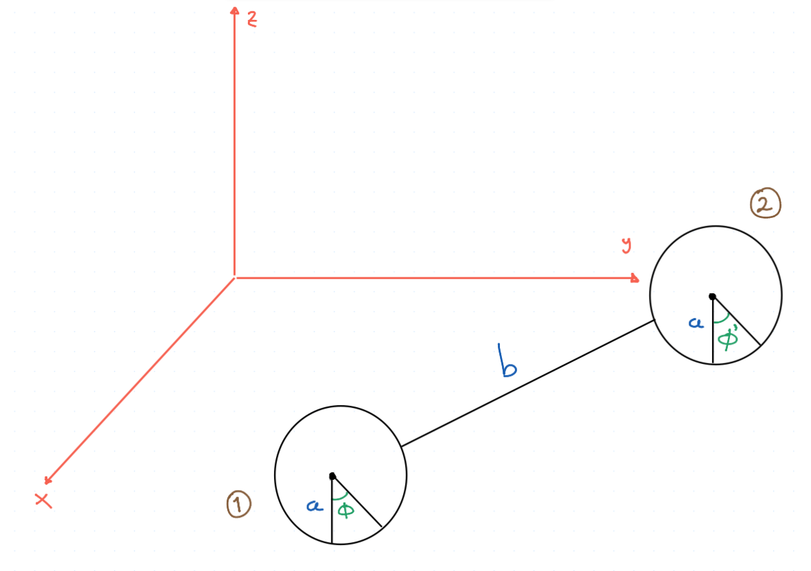

# Péndulo Esférico

Material del tema **Péndulo Esférico** (Mecánica Teórica).

---

## 📄 Documento principal

## 📄 Documento principal

- 📕 [Péndulo Esférico (PDF)](pendulo_esferico.pdf)
- 🧾 [Código fuente LaTeX (.tex)](pendulo_esferico.tex)

> Nota: los espacios se escriben como `%20` en URLs

--- 

## 🖼️ Esquemas y figuras

### Ángulos

---

### Esquema de ruedas

---

### Vista general

---

⬅️ [Volver a Mecánica Teórica]({{ site.baseurl }}/clases_2025/mecanica_teorica/)
